# Burger Queen (API Client)

## Índice

* [1. Resumen General](#1-Resumen-General)
* [2. Resumen del proyecto](#2-resumen-del-proyecto)
* [3. Recursos](#3-Recursos)
* [4. Descripción del Proyecto](#4-Descripción-del-Proyecto)
* [5. Boilerplate](#5-Boilerplate)
* [6. Despliegue](#6-despliegue)
* [7. Objetivos de aprendizaje](#7-Objetivos-de-aprendizaje)
* [8. Nuestro equipo de trabajo](#7-Nuestro-equipo-de-trabajo)
***

## 1. Resumen General

El presente proyecto se emmarca dentro del programa de desarrollo Front en de LABORATORIA. Se establece como reto el desarollo de una aplicacion para el manejo de un restaurante, que centre su diseño en la experiencia de usuario permitiendo tomar pedidos y enviarlos a la cocina, una vez listos los peiddos la cocina pueda informar a los meseros, adicionalmente administre el menú y los usuarios de la aplicación. Para esto se requiere hacer uso deuno de los siguientes frameworks y/o librerias [React](https://es.react.dev/) o [Angular](https://angular.io/).

## 2. Resumen del proyecto

**Burguer Queen** es un pequeño restaurante de hamburguesas que manej servicos 24hr y por su crecimiento acelerado necesita un sistema a través del cual puedan tomar pedidos usando una _tablet_, y enviarlos a la cocina para que se preparen ordenada y eficientemente. El menú del restautrante consta de dos secciones, una de desayunos y la otra de almuerzos. La interfaz diseñada muestra los dos menús, cada uno con todos sus _productos_. El usuario puede ir eligiendo qué _productos_
agregar y la interfaz muestra el _resumen del pedido_ con el costo total.

El **objetivo principal** del projecto de es aprender a construir una _interfaz web_ usando el _framework_ elegido, En nuestro caso elegimos React para desarrollar la aplicación.

## 3. Recursos
* Software y aplicaciones web: Visual Studio Code (para generar el código), Canva (para realizar prototipo de alta fidelidad), GitHub(repositorio del proyecto), zoom (para comunicación con coachs y compañeras), Trello (para organizar las tareas de cada sprint del proyecto). Internet(para búsqueda de información y acceso a aplicaciones web). Verser y Render para el desplieque de la aplicacion y del Api. 
* Hardware: PC de cada desarrollador.
* Tiempo: 80 horas cada intengrante del equipo aproximadamente incluyendo horas de OH e intercambio con compañeras. Estas horas incluye el tiempo de estudio e investigación.
Humano: 3 desarolladores. Colaboración adicional de acuerdo a las necesidades (coach, compañeras).

## 4. Descripción del Proyecto

Desarrollop de una aplicacion para el manejo de los pedidos de un restaurante, bajo los requerimientos planteados por el cliente.

*Planificacioón del Proyecto*
Toda la organizacion y seguimiento de las actividades se realizó a traves de la herramienta GitHub Project, como se muestra a continuacion:

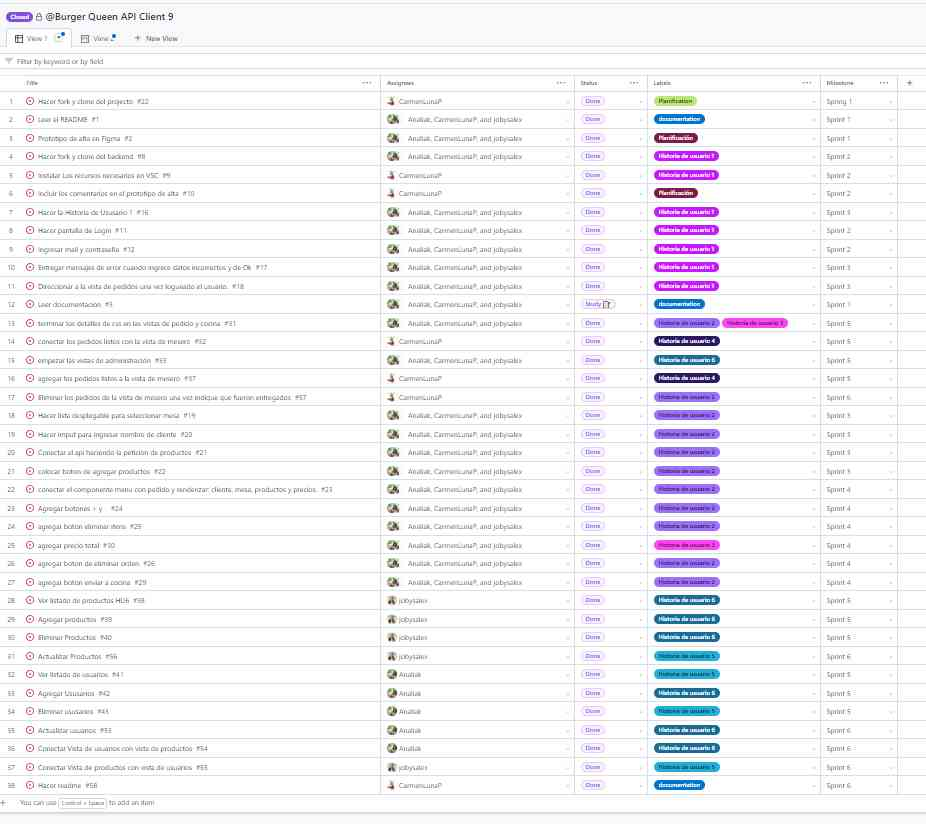

Prototipo de ALTA:
a continuacion compartimos el link al prototipo de alta realizado en Canva

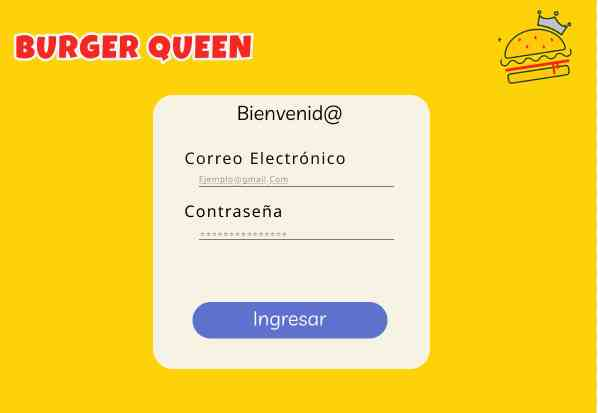
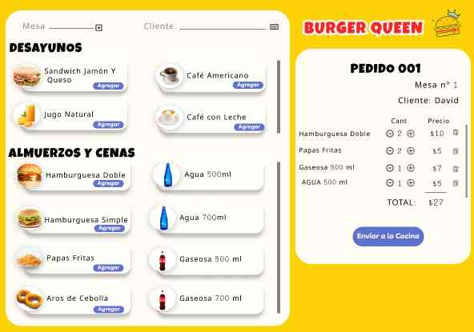
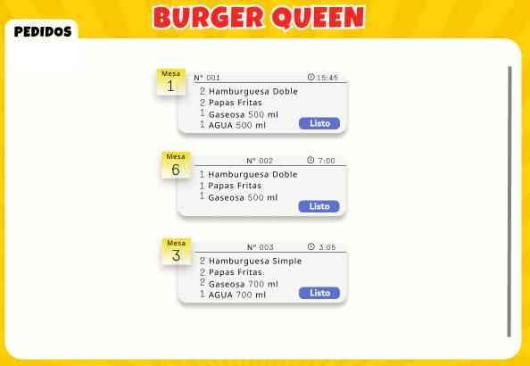
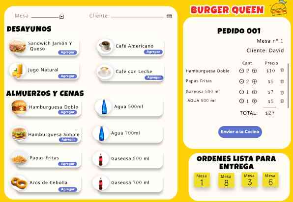

#### Desarrollo del Proyecto

El proyecto fue realizado con react, los resultados del mismo se traducen en las siguientes vistas de las historias de usuario.

#### [Historia de usuario 1] Mesero/a debe poder ingresar al sistema, si el admin ya le ha asignado credenciales

Yo como meserx quiero poder ingresar al sistema de pedidos.

##### Criterios de aceptación

Lo que debe ocurrir para que se satisfagan las necesidades del usuario.

* Acceder a una pantalla de login.
* Ingresar email y contraseña.
* Recibir mensajes de error comprensibles, dependiendo de cuál es el error
  con la información ingresada.
* Ingresar al sistema de pedidos si las crendenciales son correctas.

##### Definición de terminado

Lo acordado que debe ocurrir para decir que la historia está terminada.

* Debes haber recibido _code review_ de al menos una compañera.
* Haces _test_ unitarios y, además, has testeado tu producto manualmente.
* Hiciste _tests_ de usabilidad e incorporaste el _feedback_ del usuario.
* Desplegaste tu aplicación y has etiquetado tu versión (git tag).

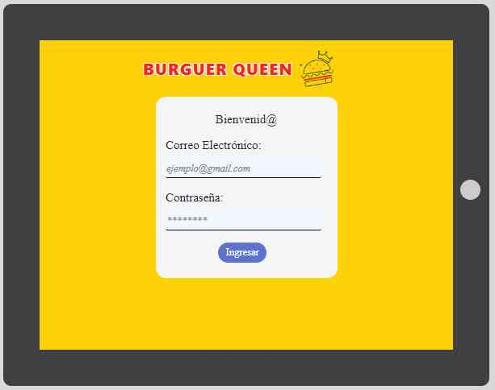

***

#### [Historia de usuario 2] Mesero/a debe poder tomar pedido de cliente/a

Yo como meserx quiero tomar el pedido de unx clientx para no depender de mi mala
memoria, para saber cuánto cobrar, y enviarlo a la cocina para evitar errores y
que se puedan ir preparando en orden.

##### Criterios de aceptación

Lo que debe ocurrir para que se satisfagan las necesidades del usuario

* Anotar nombre de clientx.
* Agregar productos al pedido.
* Eliminar productos.
* Ver resumen y el total de la compra.
* Enviar pedido a cocina (guardar en alguna base de datos).
* Se ve y funciona bien en una _tablet_

##### Definición de terminado

Lo acordado que debe ocurrir para decir que la historia está terminada.

* Debes haber recibido _code review_ de al menos una compañera.
* Haces _test_ unitarios y, además, has testeado tu producto manualmente.
* Hiciste _tests_ de usabilidad e incorporaste el _feedback_ del usuario.
* Desplegaste tu aplicación y has etiquetado tu versión (git tag).

#### [Historia de usuario 4] Meserx debe ver pedidos listos para servir

Yo como meserx quiero ver los pedidos que están preparados para entregarlos
rápidamente a lxs clientxs que las hicieron.

##### Criterios de aceptación

* Ver listado de pedido listos para servir.
* Marcar pedidos que han sido entregados.

##### Definición de terminado

* Debes haber recibido _code review_ de al menos una compañera.
* Haces _test_ unitarios y, además, has testeado tu producto manualmente.
* Hiciste _tests_ de usabilidad e incorporaste el _feedback_ del usuario.
* Desplegaste tu aplicación y has etiquetado tu versión (git tag).
* Los datos se deben mantener íntegros, incluso después de que un pedido ha
  terminado. Todo esto para poder tener estadísticas en el futuro.

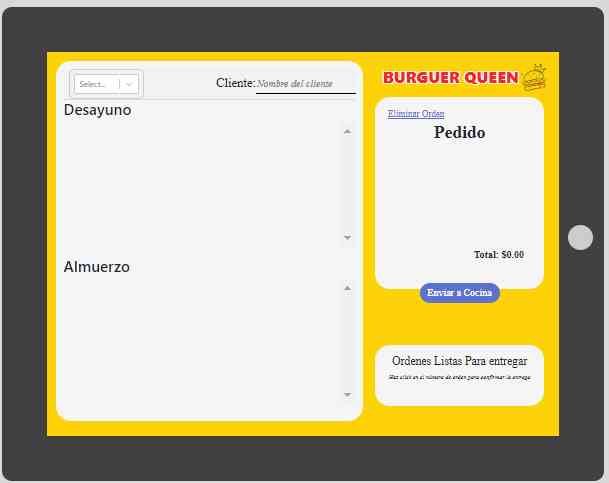

***

#### [Historia de usuario 3] Jefe de cocina debe ver los pedidos

Yo como jefx de cocina quiero ver los pedidos de lxs clientxs en orden y
marcar cuáles están listos para saber qué se debe cocinar y avisar a lxs meserxs
que un pedido está listo para servirlo a un clientx.

##### Criterios de aceptación

* Ver los pedidos ordenados según se van haciendo.
* Marcar los pedidos que se han preparado y están listos para servirse.
* Ver el tiempo que tomó prepara el pedido desde que llegó hasta que se
  marcó como completado.

##### Definición de terminado

* Debes haber recibido _code review_ de al menos una compañera.
* Haces _test_ unitarios y, además, has testeado tu producto manualmente.
* Hiciste _tests_ de usabilidad e incorporaste el _feedback_ del usuario.
* Desplegaste tu aplicación y has etiquetado tu versión (git tag).

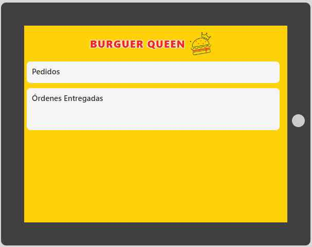

***

#### [Historia de usuario 5] Administrador(a) de tienda debe administrar a sus trabajadorxs

Yo como administrador(a) de tienda quiero gestionar a los usuarios de
la plataforma para mantener actualizado la informacion de mis trabajadorxs.

##### Criterios de aceptación

* Ver listado de trabajadorxs.
* Agregar trabajadorxs.
* Eliminar trabajadoxs.
* Actualizar datos de trabajadorxs.

##### Definición de terminado

* Debes haber recibido _code review_ de al menos una compañera.
* Haces _test_ unitarios y, además, has testeado tu producto manualmente.
* Hiciste _tests_ de usabilidad e incorporaste el _feedback_ del usuario.
* Desplegaste tu aplicación y has etiquetado tu versión (git tag).

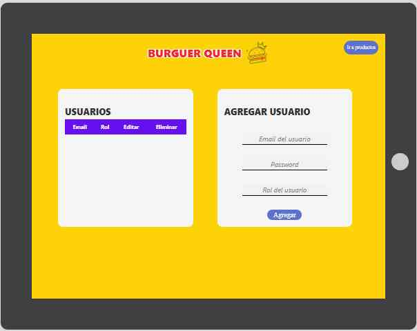

***

#### [Historia de usuario 6] Administrador(a) de tienda debe administrar a sus productos

Yo como administrador(a) de tienda quiero gestionar los productos
para mantener actualizado el menú.

##### Criterios de aceptación

* Ver listado de productos.
* Agregar productos.
* Eliminar productos.
* Actualizar datos de productos.

##### Definición de terminado

* Debes haber recibido _code review_ de al menos una compañera.
* Haces _test_ unitarios y, además, has testeado tu producto manualmente.
* Hiciste _tests_ de usabilidad e incorporaste el _feedback_ del usuario.
* Desplegaste tu aplicación y has etiquetado tu versión (git tag).

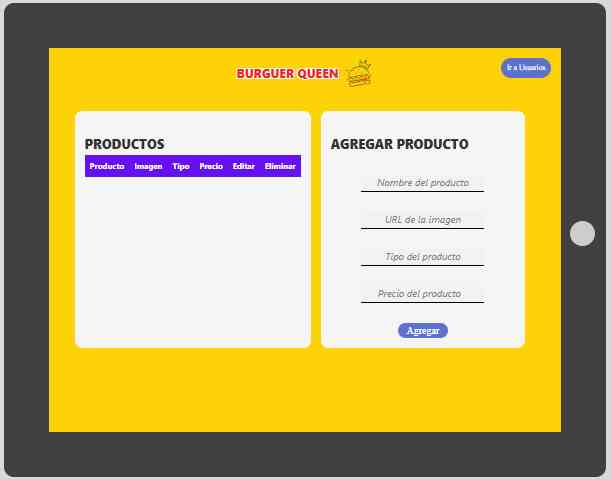

***

## 5. Boilerplate

El boilerplate contiene una estructura de archivos:

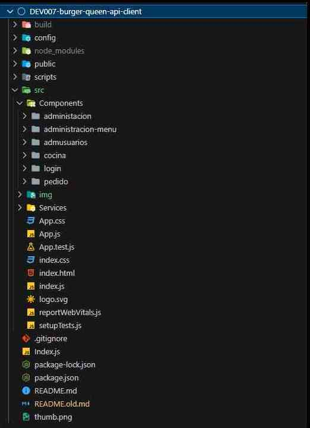

## 6. Despliegue

La interfaz fue desplegada usando Vercel: [Burger Queen App Desplegada](https://XXXXXXXXXXXX)

Puedes ingresar para visualizar el proyecto dándole click aquí en la url  y se mostrará la interfaz del logín donde podrás ingresar con los siguientes usuarios y contraseñas.

| Usuarios                  |Contraseña|Rol|
|---------------------------|----------|----------|
| anita@mail.com            |  123456  |  admin   |
| jesus@mail.com            |  123456  |  chef    |
| marcos@mail.com           |  123456  |  waiter  |

La apiMock fue desplegada usando Render : [Appi-Mock Desplegada](https://api-mock-laboratoria.onrender.com)

## 7. Objetivos de aprendizaje

Reflexiona y luego marca los objetivos que has llegado a entender y aplicar en tu proyecto. Piensa en eso al decidir tu estrategia de trabajo.

### HTML

- [ x ] **Uso de HTML semántico**

### CSS

- [ x ] **Uso de selectores de CSS**
- [ x ] **Modelo de caja (box model): borde, margen, padding**
- [ x ] **Uso de flexbox en CSS**
- [ x ] **Uso de CSS Grid Layout**
- [ x ] **Uso de media queries**

### JavaScript

- [ x ] **Pruebas unitarias (unit tests)**
- [ x ] **Pruebas asíncronas**
- [ x ] **Uso de mocks y espías**
- [ x ] **Módulos de ECMAScript (ES Modules)**
- [ x ] **Uso de linter (ESLINT)**
- [ x ] **Uso de identificadores descriptivos (Nomenclatura y Semántica)**
- [ x ] **Git: Instalación y configuración**
- [ x ] **Git: Control de versiones con git (init, clone, add, commit, status, push, pull, remote)**
- [ x ] **Git: Integración de cambios entre ramas (branch, checkout, fetch, merge, reset, rebase, tag)**
- [ x ] **GitHub: Creación de cuenta y repos, configuración de llaves SSH**
- [ x ] **GitHub: Despliegue con GitHub Pages**
- [ x ] **GitHub: Colaboración en Github (branches | forks | pull requests | code review | tags)**
- [ x ] **GitHub: Organización en Github (projects | issues | labels | milestones | releases)**

### HTTP

- [ x ] **Consulta o petición (request) y respuesta (response).**
- [ x ] **Cabeceras (headers)**
- [ x ] **Cuerpo (body)**
- [ x ] **Verbos HTTP**
- [ x ] **Códigos de status de HTTP**
- [ x ] **Encodings y JSON**
- [ ] **CORS (Cross-Origin Resource Sharing)**

### React

- [ x ] **JSX**
- [ x ] **Componentes y propiedades (props)**
- [ x ] **Manejo de eventos**
- [ x ] **Listas y keys**
- [ x ] **Renderizado condicional**
- [ x ] **Elevación de estado**
- [ x ]  **Hooks**
- [ x ] **CSS modules**
- [ x ] **React Router**

### Bases de datos

- [ x ] **Modelado de datos**

### Centrado en el usuario

- [ x ] **Diseñar y desarrollar un producto o servicio poniendo a las usuarias en el centro**

### Diseño de producto

- [ x ] **Crear prototipos de alta fidelidad que incluyan interacciones**

- [ x ] **Seguir los principios básicos de diseño visual**

### Investigación

- [ x ] **Planear y ejecutar testeos de usabilidad de prototipos en distintos niveles de fidelidad**

## 8. Nuestro equipo de trabajo
El presente proyecto fue desarrollado por:
* Analía Klein.
* Yohana Becerra.
* Carmen Luna.

*“Sin importar que tan difíciles se pongan las cosas, los sueños se pueden conseguir si en el alma se mantiene la ilusión intacta de conseguir la victoria”*